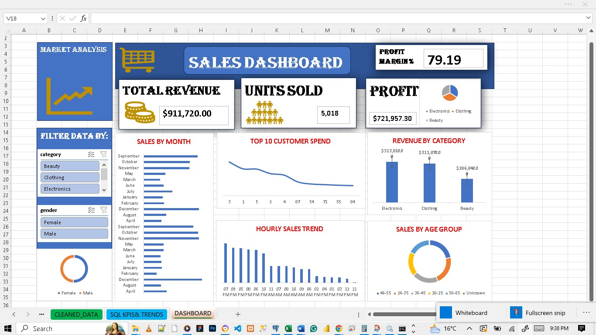
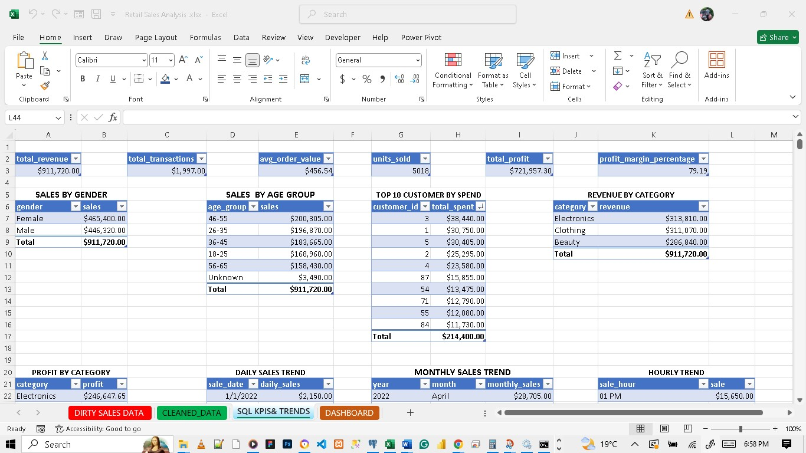
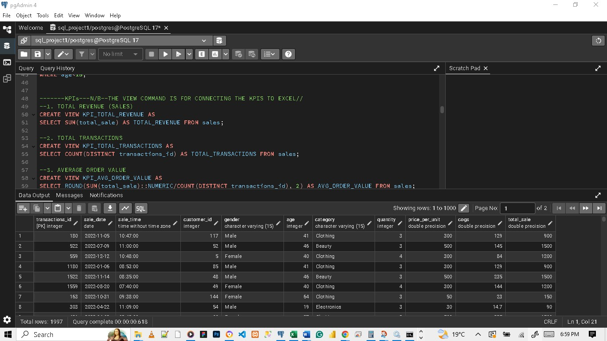

# Retail Sales Analysis Dashboard

## 📌 Project Overview
This project demonstrates how I used **SQL** and **Excel** together to clean raw sales data, calculate key business KPIs, and build an **interactive dashboard**.  
The solution helps business owners and analysts gain quick insights into sales performance, profitability, and customer behavior.

## ⚙️ Tools & Technologies
- **SQL (PostgreSQL / MySQL / SQL Server)** – Data cleaning, transformation & KPI calculations  
- **Excel** – Dashboard creation, visualization, and reporting  
- **Power Query & Views** – For connecting SQL queries directly into Excel  

## 🚀 Process
1. **Data Cleaning (SQL)**  
   - Removed duplicates & nulls  
   - Standardized columns (dates, categories, gender, etc.)  
   - Created a cleaned dataset using `CREATE VIEW`

2. **KPI Calculation (SQL)**  
   - Total Revenue  
   - Total Transactions  
   - Average Order Value  
   - Units Sold  
   - Total Profit & Profit Margin %  
   - Sales by Gender & Age Group  
   - Revenue & Profit by Category  
   - Top 10 Customers by Spend  
   - Daily & Monthly Sales Trends  
   - Peak Hours of Sales  

   Each KPI was stored in views for easy refresh in Excel.

3. **Dashboard Building (Excel)**  
   - KPI Cards (at the top)  
   - Interactive charts for trends and categories  
   - Slicers & filters for dynamic exploration  
   - Clean and professional layout  

4. **Final Deliverable**  
   - An **interactive Excel dashboard** connected to SQL data that refreshes automatically.  

## 📊 Screenshots
| Dashboard | KPI's | SQL |
|-----------|---------|--------------|
|  |  |  |

---

## 💡 Business Value
- Provides **real-time business insights** without manual calculations.  
- Saves time for management by automating KPI tracking.  
- Enables decision-makers to identify top-performing products, customers, and time periods.  

## 🔧 How I Can Help Your Business
I can help you:  
- Clean and structure your business data in SQL  
- Automate KPIs & reporting processes  
- Design professional dashboards in Excel, Power BI, or Tableau  
- Deliver **data-driven insights** that guide smart business decisions  

## 📂 Project Files
- `Retail Sales.xlsx` → Final dashboard  
- `queries.sql` → All SQL scripts (cleaning + KPIs)  
- `SCREENSHOTS/` → Preview images of the dashboard  

---
👤 **Author**: JOCK OCHIENG NJOGA  
📧 **Contact**: jocknjoga015@gmail.com
